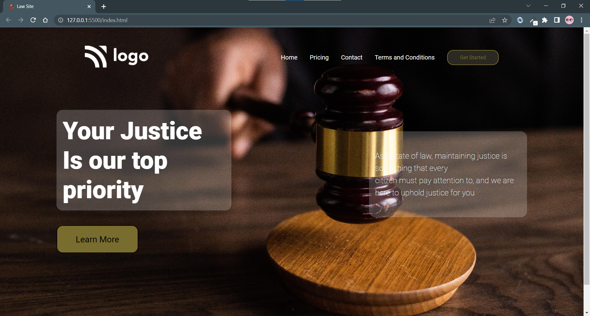

># I am Sandeep pal🙏

👉Third project on HTML and CSS.

👉Law website

>## Learnings

1️⃣ Background properties

🌟 Background image to the element.

🌟Object fit property specifies the img according to the parent element of img.

🌟Backround-repeat to use not repat the image.

__USE__🔥

```css
.container{
    background-image:url(./image/png;)
    background-repeat:no-repeat;
    object-fit:cover;

}

```

>## TIME 🕝
✳️ 2 Hour 

✳️ This project similer to my previous project that by it takes less time than the previous project.

> ### About More
⚠️ Right now the website not fully complete.

⚠️ Website is not responsive right now. 
I am working to make responsive.

🔁Update coming in future


